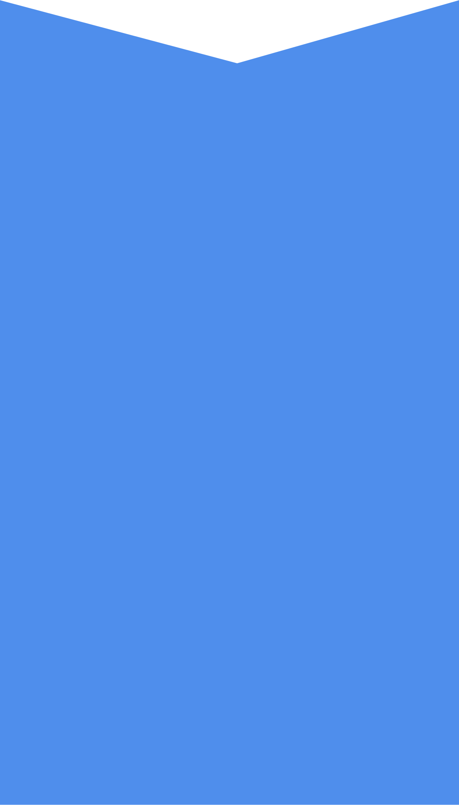

### Live version 
https://bdejene19.github.io/updatedPortfolio

# Current Bemnet Dejene Portfolio
## Description
This app is an application/evaluation of my progress, presenting my most recent projects and skills for possible future work, whether it be freelancing or full time work. The project itself is a single page application (SPA), using transitions and filters to create focus on important information and overall readibility. The app itself was prototyped using Figma for wiring framing, as well as exporting custom SVGs that I created myself for enhancing styling. Prototyping was done for the 3 major devices: desktop, tablet and mobile. App is also fully responsive to all devices.

## Table of Contents
- [Description](#description)
- [Screenshots](#live-screenshots)
- [Wireframes](#wire-frame-photos)
- [Technologies](#technologies-used)
- [Skills Learned](#what-i-learned)
- [Improvements](#improvements)
- [Contributors](#contributors)
- [Contact Info](#contact)

## Technologies Used
- React
- Email.js
- JS
- Figma
- Semantic HTML
- CSS/Sass

## Live Screenshots

### Hero

### Skills

### Projects

### Contact Form

## What I Learned
- Figma app prototyping/wireframing
- UI Hierarchy, Color Theory and Design
- Exporting of figma SVGs/element ids for possible animations
- Better techniques for responsive web design of absolutely positioned elements 

## Improvements 
- Create actual custom SVG animations to make a more enhanced user experience
- Use meta tags/React Helmets for better SEO to expand my reach globally

## Wire Frame Photos

### Desktop and Tablet Skeleton Wireframe (mobile is resized tablet)
#### Desktop Version

#### Tablet Version

### Hero Backgrounds for different screen sizes
      

### Projects Section Arrow Background

### Project Cards with Blue vs White Background Card
#### Note: white background may not be able to be seen without activating darkmode on Github
 Versus 
## Contributors 
Independent project. DM for pull requests to become a contributor for feature add-ons.
## Contact
Email: bdejene19@gmail.com

Github: https://github.com/bdejene19
